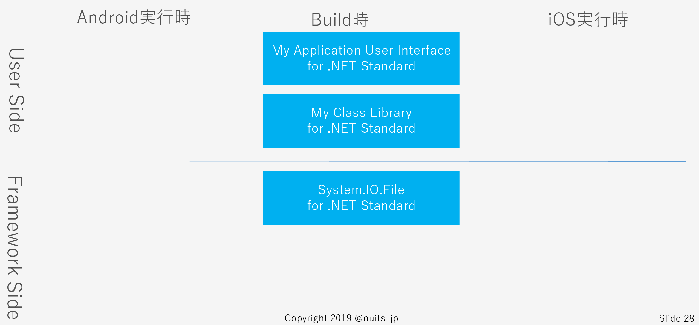
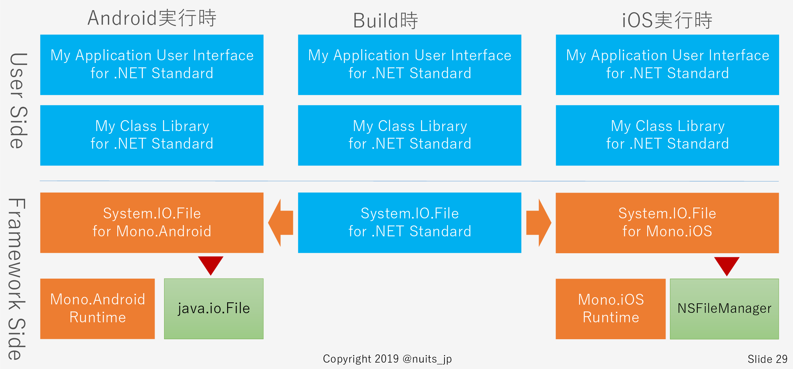
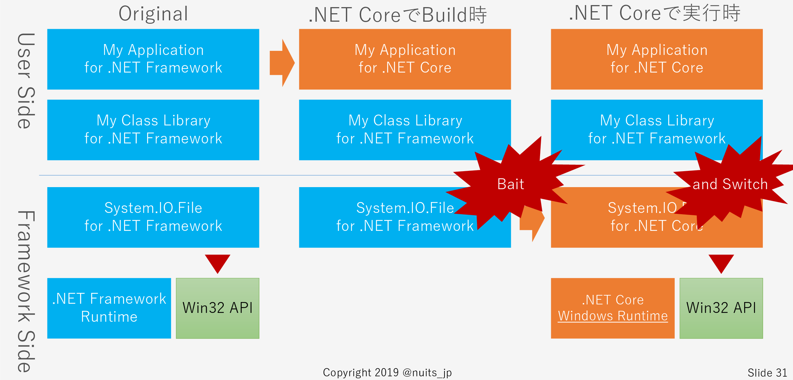

# はじめに

2019年はWPFにとって多くの意味でインパクトのある話題のある年となっています。その中でも次の二つはもっとも大きな影響を私たちに与えるでしょう。

* 9月に正式にリリースされる.NET Core 3.0でWPFがサポートされる事となった
* .NET Frameworkのメジャーバージョンが最新の4.8で最後のメジャーバージョンであると告知された

これから継続的にWPFアプリケーションに取り組んでいくうえで、.NET Core 3.0への移行は免れません。しかし新規開発ならまだしも、既存のアプリケーションを移行することは現実的なことなのでしょうか？

そこで本ハンズオンでは、実際に.NET Frameworkで構築したアプリケーションをもとに、.NET Coreへ移行していただき移行の「感覚」を理解していただこうと思います。

# 注意事項

「感覚」と表現したのは意図があります。移行の詳細をもれなく理解するには公式のドキュメントを読んでいただくのが最良でしょう。本ハンズオンではモチベーションから具体的な計画につながるそのハザマの「現実的な感覚」を理解してもらいたいと思っています。

実際の移行案件では以下の公式ドキュメントを参照してください。

[.NET Framework から .NET Core にコードを移植する](https://docs.microsoft.com/ja-jp/dotnet/core/porting)

[WPF デスクトップ アプリを .NET Core に移植する](https://docs.microsoft.com/ja-jp/dotnet/core/porting/wpf)

<!-- more -->

# WPFを.NET Coreへ移行するモチベーションとは

まず初めに、そもそもデスクトップアプリをなぜ.NET Coreで移行するのか？したいのか？
そのモチベーションについて再確認したいと思います。

私は主に次の3点から、Coreを利用したいと考えています。

1. 第一に.NET Frameworkのメジャーバージョンアップが4.8で最後であると告知されたこと
2. NET Core 3.0から、WPFやWinFormsがサポートされたということ
3. 最後に.NET Coreが非常に魅力的な特徴を持っているということ

1.の理由から、長期的に保守していくのであれば移行せざるを得ないという実情がありますが、そういったネガティブな理由だけではなく、3.の理由からより積極的に移行していきたいと私は考えています。

私が.NET Coreに対して、特に魅力を感じるところは次の3点にあります。

1. Side by Sideが復活し、異なるバージョンを共存して利用できるということ
2. Runtimeを事前にインストールしておかなくても、アプリに含めて配布できるということ
3. 軽快な動作速度を含む、先進的な機能の採用

特に1. 2. は他社アプリケーションとの競合でFrameworkがあげられないという話がよくあるので、個人的にはものすごく期待しています。

とはいえ、.NET Coreってクロスプラットフォーム用でしょ？WPF動かすなんて現実的にどうなの？という疑問はあるかと思います。その疑問の多くを解消するのが本ハンズオンの一つの目的です。

# ハンズオン概要

次のようなグリッドによるデータの表示・編集を行う.NET Frameworkで実装されたクライアントサーバー型WPFアプリケーションを、.NET Core 3.0に移行します。


移行する中で、WPFアプリケーションの.NET Coreへの移行の「感覚」を理解してもらうことを目的としています。

# ハンズオン実施環境

本ハンズオンは以下の環境を前提としています。

* Visual Studio 2019 16.1.1
* .NET Framework 4.7.2
* .NET Core 3.0.0-preview5
* SQL Server 2017 

# 環境構築

本ハンズオンを開始する前に、まずは.NET Framwrowk上で動作できるように環境を構築する必要があります。

以下の文書を参考に環境を構築してください。

[環境構築手順](Setup.md)

# 移行における懸念事項

移行において、対象のアプリケーションは次のような技術的な懸念事項を抱えています。

* ビルド後のDLLの編集（静的コード生成）
* P/Invokeを介したWin32 APIへの依存
* System.Drawing.Bitmapの利用（WindowsのGDI+への依存）

特に下二つはクロスプラットフォーム環境としては不安を感じる要素だと思います。

# 移行開始

では早速始めましょう。

## プロジェクトを.NET Core 3.0に変更する

つぎの手順で、WPFで記述されたプロジェクト（ソリューション内のEmployeeManager.Presentation）を.NET Core 3.0へ移行します。

1. .csprojをSDKスタイルに変更
2. プロジェクト参照の再適用
3. NuGetパッケージの再インストール
4. AssemblyInfo.csの削除
5. NuGetパッケージの追加インストール

### .csprojをSDKスタイルに変更

最新の.NETのプロジェクトでは.csprojファイルの形式がSDKスタイルという形式に変更になっています。

まずはEmployeeManager.Presentation.csprojを開いてい、つぎのように修正してください。

```xml
<Project Sdk="Microsoft.NET.Sdk.WindowsDesktop">

  <PropertyGroup>
    <OutputType>WinExe</OutputType>
    <TargetFramework>netcoreapp3.0</TargetFramework>
    <UseWPF>true</UseWPF>
  </PropertyGroup>

</Project>
```

### プロジェクト参照の再適用

以下のプロジェクト参照を設定し直します。

* EmployeeManager
* EmployeeManager.DatabaseAccesses
* EmployeeManager.Services
* EmployeeManager.Services.Imple

### NuGetパッケージの再インストール

NuGetパッケージをインストールし直します。

```cmd
Install-Package AutoMapper -ProjectName EmployeeManager.Presentation -Version 8.1.0
Install-Package SimpleInjector -ProjectName EmployeeManager.Presentation -Version 4.6.0
Install-Package RedSheeps.SimpleInjector.DynamicProxy -ProjectName EmployeeManager.Presentation -Version 1.0.0
Install-Package ReactiveProperty -ProjectName EmployeeManager.Presentation -Version 5.5.1
Install-Package PropertyChanged.Fody -ProjectName EmployeeManager.Presentation -Version 3.0.1
Install-Package Microsoft.Xaml.Behaviors.Wpf -ProjectName EmployeeManager.Presentation -Version 1.0.1
Install-Package MahApps.Metro -ProjectName EmployeeManager.Presentation -Version 1.6.5
```

### AssemblyInfo.csの削除

さて、この状態でビルドすると次のようなエラーが複数でます。

> System.Reflection.AssemblyCompanyAttribute' 属性が重複しています。

これはSDKスタイルの.csprojではAssenblyInfo.csに記述されていた内容は、.csprojの定義情報から自動生成されるように変わったことで、記述が重複してしまうためです。

という訳で、EmployeeManager.PresentationのPropertiesの下からAssemblyInfo.csを削除してください。この時、クリーン＆リビルドしても解消しない場合はVisual Studioの再起動することで解消されます。

### NuGetパッケージの追加インストール

さてこの状態で再ビルドするとSystem.Data.SqlClientが存在しないことでエラーが発生します。

.NET Coreでは特にMicrosoft製品に依存していて、デフォルトで参照設定されていたライブラリが外部に移動しています。それらのライブラリはNuGetに公開されていますので、そちらからインストールしましょう。

```cmd
Install-Package System.Data.SqlClient -ProjectName EmployeeManager.Presentation -Version 4.6.1
```

さて、これでビルドは通りました。では実行してみましょう。すると次のようなエラーが発生します。

```cmd
例外がスローされました: 'System.IO.FileNotFoundException' (ControlzEx.dll の中)
型 'System.IO.FileNotFoundException' の例外が ControlzEx.dll で発生しましたが、ユーザー コード内ではハンドルされませんでした
Could not load file or assembly 'System.Management, Version=4.0.0.0, Culture=neutral, PublicKeyToken=b03f5f7f11d50a3a'. 指定されたファイルが見つかりません。
```

MahApps.Metroから間接的に参照されているSystem.Managementが、System.Data.SqlClientと同様に.NET Coreから標準では参照できなくなっているためです。次のようにして追加インストールしましょう。

```cmd
Install-Package System.Management -ProjectName EmployeeManager.Presentation -Version 4.5.0
```

なお移行にあたって.NET Coreに存在しないパッケージについては、Windows 互換機能パックを利用することでも解決できます。

* Windows 互換機能パックを利用する
[https://docs.microsoft.com/ja-jp/dotnet/core/porting/windows-compat-pack:title]


さぁこれで実行できるようになりました。コードの修正は一切なく.NET Coreで動作できることが理解できたかと思います。

## サードパーティーライブラリを.NET Core対応バージョンへ移行する

ところで先ほど発生したSystem.Managementが参照できない問題ですが、これはそれを間接的に参照していたMahApps.MetroのStable Release版が.NET Core 3.0に対応していないため発生します。

そこでまだPreviewですが、MahApps.Metroを.NET Core 3.0に対応したバージョンにアップデートしましょう。

```cmd
Install-Package MahApps.Metro -ProjectName EmployeeManager.Presentation -Version 2.0.0-alpha0316
```

このバージョンではリソースの設計に破壊的変更が入っているため、App.xamlを修正する必要があります。App.xamlを開き、以下のように記述されている箇所を修正します。

```xml
<!-- MahApps.Metro resource dictionaries. Make sure that all file names are Case Sensitive! -->
<ResourceDictionary Source="pack://application:,,,/MahApps.Metro;component/Styles/Controls.xaml" />
<ResourceDictionary Source="pack://application:,,,/MahApps.Metro;component/Styles/Fonts.xaml" />
<ResourceDictionary Source="pack://application:,,,/MahApps.Metro;component/Styles/Colors.xaml" />
<!-- Accent and AppTheme setting -->
<ResourceDictionary Source="pack://application:,,,/MahApps.Metro;component/Styles/Accents/Magenta.xaml" />
<!-- theme resource -->
<!-- change "BaseLight" to the theme you want -->
<ResourceDictionary Source="pack://application:,,,/MahApps.Metro;component/Styles/Accents/BaseLight.xaml" />
```

ここを以下のように修正してください。

```xml
<!-- MahApps.Metro resource dictionaries. Make sure that all file names are Case Sensitive! -->
<ResourceDictionary Source="pack://application:,,,/MahApps.Metro;component/Styles/Controls.xaml" />
<ResourceDictionary Source="pack://application:,,,/MahApps.Metro;component/Styles/Fonts.xaml" />
<ResourceDictionary Source="pack://application:,,,/MahApps.Metro;component/Styles/themes/light.magenta.xaml" />
```

あとは不要になったSystem.Managementパッケージをアンインストールしましょう。

```cmd
Uninstall-Package System.Management
```

これで「EmployeeManager.Presentationプロジェクトは」.NET Core 3.0へ移行することができました。

# WPFへの移行が比較的容易な本誌素敵な理由

さて、すでにこの段階でいくつか疑問が浮かんでいる方も多いかと思います。

そうです。特に次の点に疑問を持った方が多いのではないでしょうか？

* MahApps.Metroが.NET Core非対応版でも動作していた
* EmployeeManager.Presentation以外のプロジェクトは.NET Frameworkのまま

.NET Coreはクロスプラットフォーム開発プラットフォームなのに、なぜ.NET Frameworkのモジュールが動作していたのでしょうか？

この点の疑問が理解できると、WPFという巨大なフレームワークが比較的安全に.NET Coreに移行できた理由が理解できます。

このことは、私的にはXamarinの例をとって考えると非常にわかりやすいです。

Xamarinでは共通コードは.NET Standardで記載します。



.NET Standardで実装された共通のUIライブラリは、.NET Standardで実装されたクラスライブラリを利用しているとします。そのクラスの中でファイルIOを実装していたとしましょう。

そうした場合、実際にはどのように動作するでしょうか？例えばAndroidの場合は左のようになります。



ビルド時には.NET StandardのFileクラスを参照してビルドしていましたが、実行時にはMono.Androidで実装されたFileクラスが呼び出されます。そしてその中では、Androidのネイティブであるjava.io.Fileが呼び出されることによってファイル操作が実現されます。

iOSであっても同様です。

これは一般的に「Bait and Switch」と呼ばれる手法です。


元々は「おとり商法」の意味で、例えば不動産屋なんかで、ネットで有料広告を売っておいて店頭に言ったら

「いやお客さんその物件さっき契約されちゃいまして。ちょっと高いですけどこんな物件どうですか？」

といった最初から存在しないBaitつまり餌でつっておいて、Switchここでは小枝でむち打ちという意味だそうですが、Switchすることが語源だそうです。

.NET StandardのFileというBaitで釣っておいて、ビルドしておいて、実行時は各プラットフォームにSwitchするわけです。この場合別に鞭打たれていませんけどね。

では.NET FrrameworkとCoreに置き換えて考えてみましょう。



最初、すべてのモジュールは.NET Frameworkでビルドされていました。

そしてMy Applicationを.NET Coreに置き換えました。しかしライブラリは依然Frameworkのままです。したがってライブラリが参照するのもFrameworkのFileクラスです。

これを実行するランタイムはWindows用のCoreランタイムです。従って実行時のFileクラスは.NET CoreのWindows用のランタイムになります。

実行環境がLinuxならランタイムもFileクラスもLinux用のものになります。

つまりここでBait and Switchが発生しているわけです。

この状況で動作する特に重要なポイントは次の二つです。

* ひとつは、中間言語は共通仕様であってFrameworkでもCoreでも変わりない事
* そして別にWPFとは関係なく、もともと.NETからネイティブのAPIを呼び出す仕組みは.NET Frameworkにも.NET Coreにも備わっているからになります。

従って、条件を満たせば実のところ.NET Framework向けにビルドされたモジュールは.NET Coreでも動作します。

実際にPresentation以外のプロジェクトは.NET Frameworkのままで動作していますし、MahApps.Metroも不足パッケージを追加することで動作することができました。

そしてこの前提があったからこそ、.NET CoreにWPFやWinFormsが比較的簡単に、そして安全に移行できているのだと思います。多分。

ただもちろん注意は必要です。.NET Frameworkと.NET Coreの二つのFileクラスは完全に別物になります。

例えばライブラリから利用しているメソッドが、Frameworkには存在しても、Coreには存在しないということは起こりえます。

この場合、ビルドは通って実行時エラーになります。

このためFrameworkでビルドされたモジュールも、Core環境で動作する可能性がありますが、直接・間接的に.NET Coreでサポートされていない物に依存している可能性があります。

既にFrameworkビルド済みのサードパーティライブラリが、Coreで動作するかどうかは、.NET Portability Analyzerでは分かりません。また一時的に動作しても、内部分岐次第では、非常に低い確率で突如実行時エラーになるということがあり得ます。

このため、特別な理由があってFrameworkのライブラリを利用せざるを得ず、かつ利用しても問題がないという何らかの確証がないかぎり、基本的には.NET CoreやStandard対応のライブラリを利用したほうが安全だと思います。

# まとめ

さて、最後にまとめましょう。

* .NET CoreがWPFをサポートすることは非常に魅力的です。
* また移行自体は、もちろんなんでも移行できるわけではありませんが、条件が整えば比較的簡単に移行できそうです。
* 特にフレームワーク自体は基本的に変更がないため、移行の際に気になる移行ツールの信頼性や、ツールで移行した後の構成管理で悩む必要がないのが大きなメリットです。
* 移行する際には、すでに公式のドキュメントが用意されていますので、まずはそちらを確認しましょう。
* 公式ドキュメントにも、Frameworkのライブラリが利用できる旨記述がありますがやはり危険なケースもありますから、可能であればCoreもしくはStandardに統一したほうがよいのではと私は考えています。

また.NET Coreには.NET Frameworkにはあったけど、正式に対応しないことが明言されているものが存在します。AppDomainや.NET Remotingなどで、詳細はこちらのリンクに記載があります。

* [https://docs.microsoft.com/ja-jp/dotnet/core/porting/net-framework-tech-unavailable:title]

ここに記載されている以外でも、例えばWCFは.NET Coreへ移行されないことが明言されていますし、Entity FrameworkもEntity Framework Coreが存在はしますが、完全な互換性はありません。

このため、そういったものを利用している場合、自分のコードであれば.NET Portability Analyzerでチェックして別の実現手段によって解決する必要があります。

またサードパーティライブラリの場合は.NET Coreもしくは.NET Standard対応のライブラリに移行していただく必要があります。

以上です。

なにか疑問があれば気軽に[Twitter](https://twitter.com/nuits_jp)にでもお問い合わせください。

